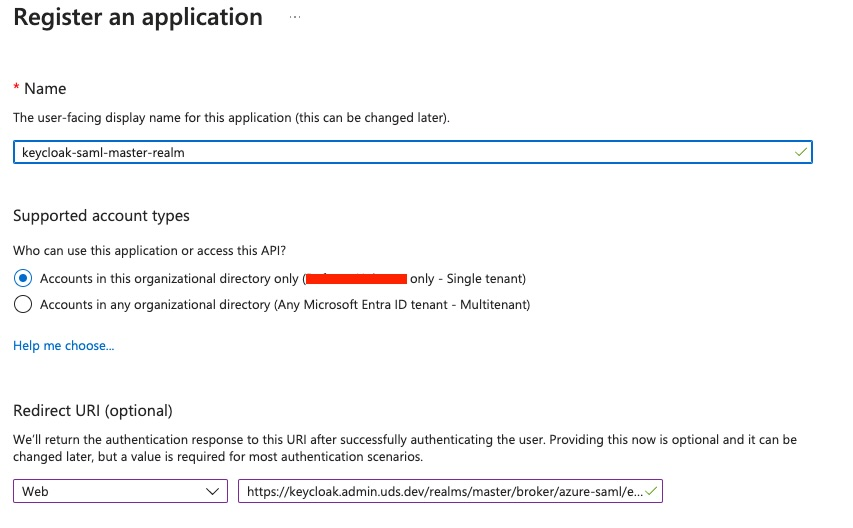
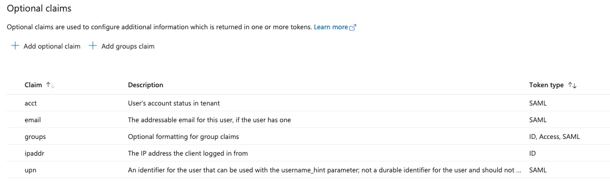

# Integrating Azure Entra ID as a SAML Identity Provider within Keycloak

UDS Core deploys Keycloak for Identity and Access Management (IAM). Keycloak provides centralized authentication, enabling single sign-on (SSO) and role-based access control (RBAC) to restrict access to authorized users. You may wish to integrate another identity provider with Keycloak so that your existing user base can access applications within UDS Core. This guide will walk you through the steps required to configure Azure Entra ID as a SAML identity provider in Keycloak.

## Prerequisites

- Access to your Azure Entra ID Tenant, with at least [Cloud Application Administrator](https://learn.microsoft.com/en-us/entra/identity/role-based-access-control/permissions-reference#cloud-application-administrator) Privileges.
- Existing Entra ID Groups that are designated for Administrators and Auditors of UDS Core Applications (see note below).

> UDS Core comes with two preconfigured user groups in Keycloak: `Admin` and `Auditor`. These groups are assigned roles to the various applications deployed by UDS Core, outlined [here](https://uds.defenseunicorns.com/reference/configuration/uds-user-groups/). Using [Identity Provider Mappers](https://www.keycloak.org/docs/latest/server_admin/#_mappers) in Keycloak, we can map your existing Administrator and Auditor groups in Azure Entra ID to the `Admin` and `Auditor` groups in Keycloak.

### Creating Application Registrations in Azure Entra ID
In this section, we will configure Application Registrations for each Keycloak realm deployed with UDS Core - the default `master` realm and the `uds` realm. The two App Registrations should be nearly identical, with the main difference being their `Redirect URI`.

#### Create App Registration - Master Realm
1. In Azure Entra ID, navigate to the "App registrations" page under "Manage". 
1. Click "New registration". 
1. Input a name for the application. 
1. Under "Supported Account Types", select "Accounts in this organizational directory (<Your tenant name> only - Single tenant)". 
1. Under "Redirect URI", select "Web" from the drop down menu and then input the following as the URL: `https://keycloak.<admin_domain>/realms/master/broker/azure-saml/endpoint`. 
1. Click "Register" when done.

Once created, you will be directed to your application's configuration page in Entra ID. Follow the steps below to configure the App Registration:
1. On the left-hand side, navigate to "Manage" > "Token configuration". Here you will need to add the following as "Optional claims":

    | Claim | Token Type |
    | ------ | ------ |
    | `acct` | SAML |
    | `email` | SAML |
    | `ipaddr` | ID |
    | `upn` | SAML |

> When adding these claims, a dialogue box will appear that says "Some of these claims (email, upn) require OpenID Connect scopes to be configured through the API permissions page or by checking the box below.". Select the chechbox that says "Turn on the Microsoft Graph email, profile permission (required for claims to appear in token). Click "Add".

1. You will also need to add a "Groups claim" as follows: 
   1. Select "All groups" under "Select group types to include in Access, ID, and SAML tokens." Accept the default values for the rest.
   1. Click "Add" when done.

 

1. Next, Navigate to "Expose an API" under "Manage"
  1. On the top of the page, you will see "Application ID URI". Click "Add".
  1. The window that appears should automatically populate with `api://<Application (Client ID)>`. Note this value. You will need it for configuring the Azure SAML Identity Provider in Keycloak later.
  1. Click "Save".

#### Create App Registration - UDS Realm
Repeat the steps above to create a new App Registration for the UDS Realm. Note the following caveats below:
1. When you get to step 3, ensure that you provide the Application Registration a unique name.
1. When asked to provide a "Redirect URI", provide the following: `https://sso.<domain>/realms/uds/broker/azure-saml/endpoint`
1. Continue with next steps.

Proceed to the next page for setting up a [SAML Identity Provider in Keycloak](./entra-keycloak-integration.md).

#### References
- [Quickstart: Register an application with the Microsoft identity platform](https://learn.microsoft.com/en-us/entra/identity-platform/quickstart-register-app?tabs=certificate)
- [Enable single sign-on for an enterprise application](https://learn.microsoft.com/en-us/entra/identity/enterprise-apps/add-application-portal-setup-sso)