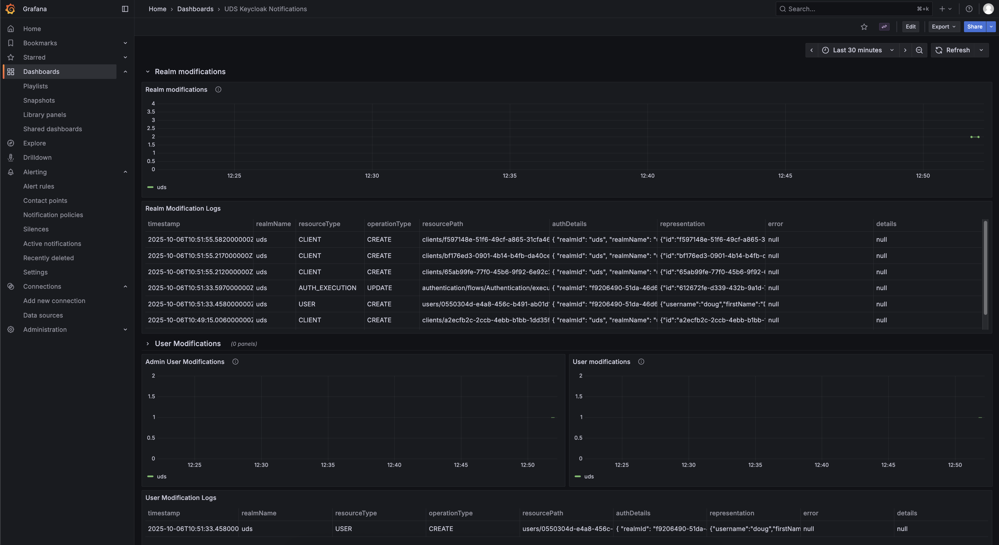

import { Steps } from '@astrojs/starlight/components';

## What you'll accomplish

You'll enable Prometheus alerting rules for Keycloak so that changes to realm configurations, user accounts, and system administrator memberships fire alerts through Alertmanager. UDS Core already collects Keycloak event logs and converts them into Prometheus metrics by default. This guide enables the alerting rules that act on those metrics.

## Prerequisites

- [UDS CLI](https://github.com/defenseunicorns/uds-cli/releases) installed
- [UDS Registry](https://registry.defenseunicorns.com) account created and authenticated locally with a read token
- Access to a Kubernetes cluster with UDS Core deployed

## Before you begin

UDS Core ships three layers of Keycloak observability, each controlled by a `detailedObservability` Helm value:

| Helm value | Default | Description |
|---|---|---|
| `detailedObservability.logging.enabled` | `true` | Sets Keycloak's `JBossLoggingEventListenerProvider` to `info` level with sanitized, full-representation output |
| `detailedObservability.dashboards.enabled` | `true` | Loki recording rules that convert event logs into Prometheus metrics, plus the **UDS Keycloak Notifications** Grafana dashboard |
| `detailedObservability.alerts.enabled` | `false` | PrometheusRule alerts that fire when the recording-rule metrics detect changes |

> [!NOTE]
> The recording-rules ConfigMap is created when either `detailedObservability.dashboards.enabled` or `detailedObservability.alerts.enabled` is `true`. Enabling alerts (as this guide does) also activates the recording rules if they are not already present.

Because logging and dashboards are enabled by default, you can already view Keycloak event metrics in Grafana without any configuration. This guide enables the third layer (alerting rules) so that changes trigger notifications through Alertmanager.

## Steps

<Steps>

1. **Enable Keycloak alerting rules**

   Add the following override to your UDS Bundle configuration:

   ```yaml title="uds-bundle.yaml"
   packages:
     - name: core
       repository: registry.defenseunicorns.com/public/core
       ref: x.x.x-upstream
       overrides:
         keycloak:
           keycloak:
             values:
               # Enable Prometheus alerting rules for Keycloak event modifications
               - path: detailedObservability.alerts.enabled
                 value: true
   ```

   The override creates a `PrometheusRule` with three alerts based on the recording-rule metrics that are already active by default:

   | Alert | Description |
   |---|---|
   | `KeycloakRealmModificationsDetected` | **warning:** Fires on realm configuration changes within a 5-minute window |
   | `KeycloakUserModificationsDetected` | **warning:** Fires on user or group membership changes within a 5-minute window |
   | `KeycloakSystemAdminModificationsDetected` | **critical:** Fires on system administrator membership changes within a 5-minute window |

   > [!NOTE]
   > `KeycloakSystemAdminModificationsDetected` uses two detection branches. When `JSONLogEventListenerProvider` is active, it filters specifically on `/UDS Core/Admin` group membership changes. When the standard `org.keycloak.events` logger is active, it matches all `USER|GROUP_MEMBERSHIP` resource changes — that logger does not expose group paths, so narrower filtering is not possible.

   > [!NOTE]
   > All three alerts have a 1-minute pending period (`for: 1m`). An alert stays in `PENDING` state for up to 60 seconds after the condition first evaluates true before transitioning to `FIRING` and notifying Alertmanager.

   Alertmanager receives all three alerts. To route them to Slack, PagerDuty, email, or other channels, see [Route alerts to notification channels](/how-to-guides/monitoring-and-observability/route-alerts-to-notification-channels/).

2. **Create and deploy your bundle**

   Build the bundle and deploy it to your cluster:

   ```bash
   uds create <path-to-bundle-dir>
   uds deploy uds-bundle-<name>-<arch>-<version>.tar.zst
   ```

</Steps>

## Verification

Confirm alerting rules are active:

```bash
# Verify the PrometheusRule exists
uds zarf tools kubectl get prometheusrule -n keycloak

# Verify recording rules ConfigMap exists (should already be present by default)
uds zarf tools kubectl get configmap -n keycloak -l loki_rule=1
```

Verify through the Grafana UI:

- **Alerts:** Open Grafana **Alerting > Alert rules** and filter for `Keycloak`. The three Keycloak alerts should appear in the list.
- **Recording rules:** Open Grafana **Explore**, select the **Prometheus** datasource, and query `uds_keycloak:realm_modifications_count`. If the metric returns data, the recording rules are working.
- **Dashboard:** Navigate to the **UDS Keycloak Notifications** dashboard in Grafana to view the metrics and associated log tables.

The dashboard displays metric counts and associated Keycloak event log tables for each modification type.



## Troubleshooting

### Problem: Alerts not firing after enabling `detailedObservability.alerts.enabled`

**Symptom:** You set `detailedObservability.alerts.enabled` to `true`, but no alerts appear in Grafana Alerting.

**Solution:** Verify the `PrometheusRule` exists:

```bash
uds zarf tools kubectl get prometheusrule -n keycloak
```

If the `PrometheusRule` exists but alerts are not firing, confirm that Keycloak is logging events. Open Grafana **Explore**, select the **Loki** datasource, and run one of the following queries depending on which event listener is active in the target realm:

```text
{app="keycloak", namespace="keycloak"} | json | loggerName="uds.keycloak.plugin.eventListeners.JSONLogEventListenerProvider"
```

```text
{app="keycloak", namespace="keycloak"} | json | loggerName=~"org.keycloak.events"
```

If neither query returns results, Keycloak may not have an event listener configured for the target realm. Check **Realm Settings > Events > Event Listeners** in the Keycloak Admin Console to confirm at least one listener is present.

## Related documentation

- [Route alerts to notification channels](/how-to-guides/monitoring-and-observability/route-alerts-to-notification-channels/) - Configure Alertmanager to deliver Keycloak alerts to Slack, PagerDuty, email, and more
- [Create log-based alerting and recording rules](/how-to-guides/monitoring-and-observability/create-log-based-alerting-and-recording-rules/) - Write custom Loki alerting and recording rules
- [Create metric alerting rules](/how-to-guides/monitoring-and-observability/create-metric-alerting-rules/) - Define additional Prometheus-based alerting conditions
- [Prometheus: Alertmanager receiver integrations](https://prometheus.io/docs/alerting/latest/configuration/#receiver-integration-settings) - Full list of supported notification channels
- [Identity & Authorization concepts](/concepts/core-features/identity-and-authorization/) - Background on how Keycloak and SSO work in UDS Core
