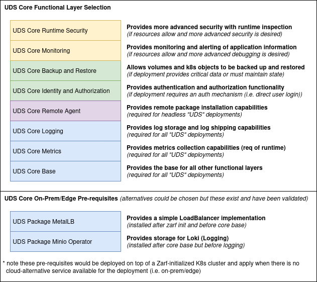

## Background

Context on the inclusion of "functional layers" can be viewed in our [ADR](https://github.com/defenseunicorns/uds-core/blob/main/adrs/0002-uds-core-functional-layers.md). In short, UDS Core publishes smaller Zarf packages that contain subsets of core's capabilities, grouped by their function (such as monitoring, logging, backup/restore, etc) to allow more flexibility in deployment. This helps to support resource constrained environments (edge deployments) and other situations where an environment has different needs than the default core stack.

Each layer is published as an individual OCI Zarf package. Package sources can be viewed under the [`packages` directory](https://github.com/defenseunicorns/uds-core/tree/main/packages), with each folder containing a readme detailing the contents and any dependencies. All layers assume the requirement of the base layer which provides Istio, the UDS Operator, and UDS Policy Engine.

:::caution
By removing pieces of core from your deployment you may affect your security and compliance posture as well as reduce functionality of the stack. Deploying core using these layers should be the exception in most cases and only done after carefully weighing needs for your environment.
:::

## Example Usage

Functional layers are designed to be combined into a UDS bundle for deployment. The example below shows all layers in the correct order. Keep in mind that 'base' must always be the first layer, and any other layers should follow based on their dependency order. When building your bundle, you can skip layers that don't fit your deployment needs and apply overrides to individual layers as needed. Ensure all layers are using the same version for compatibility.

```yaml
kind: UDSBundle
metadata:
  name: functional-layer-core-bundle
  description: An example bundle for deploying all of core using functional layers
  version: "0.1.0"

packages:
  - name: core-base
    repository: ghcr.io/defenseunicorns/packages/uds/core-base
    ref: 0.29.0-upstream
  - name: core-identity-authorization
    repository: ghcr.io/defenseunicorns/packages/uds/core-identity-authorization
    ref: 0.29.0-upstream
  - name: core-metrics-server
    repository: ghcr.io/defenseunicorns/packages/uds/core-metrics-server
    ref: 0.29.0-upstream
  - name: core-runtime-security
    repository: ghcr.io/defenseunicorns/packages/uds/core-runtime-security
    ref: 0.29.0-upstream
  - name: core-logging
    repository: ghcr.io/defenseunicorns/packages/uds/core-logging
    ref: 0.29.0-upstream
  - name: core-monitoring
    repository: ghcr.io/defenseunicorns/packages/uds/core-monitoring
    ref: 0.29.0-upstream
  - name: core-backup-restore
    repository: ghcr.io/defenseunicorns/packages/uds/core-backup-restore
    ref: 0.29.0-upstream
```

## Layer Selection

Layer selection will always be deployment-specific but below are guidelines for what layers should be considered _required_ and when you may wish to select other layers for your deployment.  This guidance follows other DoD guidance such as the [Big Bang Conformant Stack](https://repo1.dso.mil/big-bang/product/bbtoc/-/blob/master/policy/conformance.md?ref_type=heads) though you may need to tweak it for your needs.



:::note
You may need to deploy pre-requisite packages that are not a part of UDS Core's layers if you are on prem or in an edge scenario as mentioned in the diagram above.
:::
