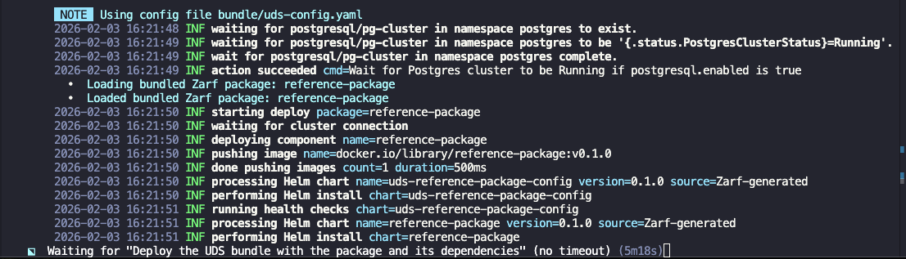

This guide highlights common roadblocks in UDS Package deployments and outlines general debugging techniques.

## Package Deployment Stuck in Helm "performing Helm install" State
A UDS Package may occasionally appear to stall during deployment. This section outlines a common scenario and a practical approach to diagnosing the issue.

The example below reflects a terminal session with a deployment of the UDS Package `reference-package`, which has remained on the same deployment step for several minutes without progressing.

**Deployment Stalled for 5+ Minutes**



:::tip
If you prefer a UI-based workflow, you can inspect events using K9s or `uds zarf tools monitor`.
:::

**Command**
```sh
helm status reference-package -n reference-package
```

**Output**
```sh
NAME: reference-package
LAST DEPLOYED: Wed Feb 18 15:03:51 2026
NAMESPACE: reference-package
STATUS: pending-install
REVISION: 1
DESCRIPTION: Initial install underway
RESOURCES:
==> v1/Deployment
NAME                READY   UP-TO-DATE   AVAILABLE   AGE
reference-package   0/1     0            0           109s
```

When we view the `helm release` we see the release is stuck in a `pending-install` state.

When troubleshooting, it is common to inspect `Pods` or `Deployments`. However, in cases such as this one, those resources may not yet exist or may not provide enough detail to explain the delay. In these situations, reviewing namespace `Events` is often the most effective way to identify the underlying issue.

**Command**
```sh
uds zarf tools kubectl get events -n reference-package
```

**Output**
```sh
LAST SEEN   TYPE      REASON              OBJECT                                    MESSAGE
8m26s       Warning   FailedCreate        replicaset/reference-package-674cc4c88b   Error creating: admission webhook "pepr-uds-core.pepr.dev" denied the request: Pod level securityContext does not meet the non-root user requirement.
```

This message indicates that the `pepr` admission webhook rejected the request because the application’s Helm chart is configured to run the container as the root user, which violates the enforced non-root security policy.

To resolve this particular issue, update the application’s security configuration in the appropriate values file for the chart that deploys the affected image. In this sample instance, it would be `values/common-values.yaml`. When multiple values files are used, each image flavor may define its own security context, so the change may need to be applied in the values file corresponding to the specific image being deployed. An example is shown below:

```yaml
podSecurityContext:
  runAsUser: 1000
  runAsGroup: 1000
  fsGroup: 1000

securityContext:
  capabilities:
    drop:
    - ALL
  readOnlyRootFilesystem: true
  runAsNonRoot: true
  allowPrivilegeEscalation: false
```
## How to Determine If a Package Violates Pepr Policies
To inspect Pepr operations running in a cluster, use the [uds monitor pepr](https://uds.defenseunicorns.com/reference/cli/commands/uds_monitor_pepr/) command. This helps identify policy violations related to package requirements.

**Example: DENIED policy**
```sh
uds monitor pepr denied
```

**Output**
```sh
 ✗ DENIED    reference-package/reference-package-67dd4655d7-jq9xk                                                                                   
             Pod level securityContext does not meet the non-root user requirement.
```

If a package violates Pepr policies, it will be listed with the reason for denial, such as a missing security context or other baseline requirement.

## Remove a Package From the Cluster
- List installed packages using [zarf package list](https://docs.zarf.dev/commands/zarf_package_list/)
- Remove installed packages using [zarf package remove](https://docs.zarf.dev/commands/zarf_package_remove/)

## References
### Kubernetes Troubleshooting
- [Kubernetes Troubleshooting Clusters Guide](https://kubernetes.io/docs/tasks/debug/debug-cluster/)
- [Kubernetes Troubleshooting Applications Guide](https://kubernetes.io/docs/tasks/debug/debug-application/)

### Helm Troubleshooting
A solid understanding of Helm is highly beneficial when troubleshooting deployments. The following Helm commands are commonly used during debugging and can help diagnose and resolve issues efficiently.

- [helm template](https://helm.sh/docs/helm/helm_template/) - If you have a helm template you believe is not configured properly.
- [helm values](https://helm.sh/docs/helm/helm_show_values/) - If you want to view an upstream chart `Values.yaml` locally. 

  `helm values` example:

  ```sh
  helm show values oci://ghcr.io/uds-packages/reference-package/helm/reference-package
  ```

For additional guidance, refer to the [Helm Troubleshooting docs](https://helm.sh/docs/v3/faq/troubleshooting/).