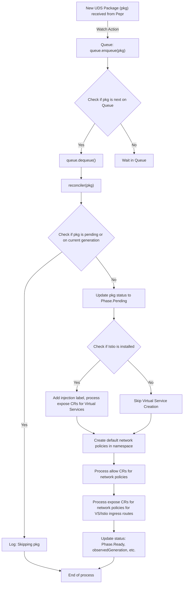

## UDS Operator

The UDS Operator manages the lifecycle of UDS Package CRs and their corresponding resources (e.g. NetworkPolicies, Istio VirtualServices, etc.) as well UDS Exemption CRs. The operator uses [Pepr](https://pepr.dev) to bind the watch operations to the enqueue and reconciler. The operator is responsible for:

#### Package

- enabling Istio sidecar injection in namespaces where the CR is deployed
- establishing default-deny ingress/egress network policies
- creating a layered allow-list based approach on top of the default deny network policies including some basic defaults such as Istio requirements and DNS egress
- providing targeted remote endpoints network policies such as `KubeAPI` and `CloudMetadata` to make policies more DRY and provide dynamic bindings where a static definition is not possible
- creating Istio Virtual Services & related ingress gateway network policies

#### Exemption

- allowing exemption custom resources only in the `uds-policy-exemptions` namespace unless configured to allow in all namespaces (see [configuring policy exemptions](../../../docs/CONFIGURE_POLICY_EXEMPTIONS.md))
- updating the policies Pepr store with registered exemptions

### Example UDS Package CR

```yaml
apiVersion: uds.dev/v1alpha1
kind: Package
metadata:
  name: grafana
  namespace: grafana
spec:
  network:
    # Expose rules generate Istio VirtualServices and related network policies
    expose:
      - service: grafana
        selector:
          app.kubernetes.io/name: grafana
        host: grafana
        gateway: admin
        port: 80
        targetPort: 3000

    # Allow rules generate NetworkPolicies
    allow:
      - direction: Egress
        selector:
          app.kubernetes.io/name: grafana
        remoteGenerated: Anywhere

      - direction: Egress
        remoteNamespace: tempo
        remoteSelector:
          app.kubernetes.io/name: tempo
        port: 9411
        description: "Tempo"

  # SSO allows for the creation of Keycloak clients and with automatic secret generation
  sso:
    - name: Grafana Dashboard
      clientId: uds-core-admin-grafana
      redirectUris:
        - "https://grafana.admin.uds.dev/login/generic_oauth"
```

### Example UDS Exemption CR

```yaml
apiVersion: uds.dev/v1alpha1
kind: Exemption
metadata:
  name: neuvector
  namespace: uds-policy-exemptions
spec:
  exemptions:
    - policies:
        - DisallowHostNamespaces
        - DisallowPrivileged
        - RequireNonRootUser
        - DropAllCapabilities
        - RestrictHostPathWrite
        - RestrictVolumeTypes
      matcher:
        namespace: neuvector
        name: "^neuvector-enforcer-pod.*"

    - policies:
        - DisallowPrivileged
        - RequireNonRootUser
        - DropAllCapabilities
        - RestrictHostPathWrite
        - RestrictVolumeTypes
      matcher:
        namespace: neuvector
        name: "^neuvector-controller-pod.*"

    - policies:
        - DropAllCapabilities
      matcher:
        namespace: neuvector
        name: "^neuvector-prometheus-exporter-pod.*"
```

### Example UDS Package CR with SSO Templating

By default UDS generates a secret for the SSO client with all the contents of the client as an opaque secret such that each key is it's own env variable or file (depending on how you mount the secret). If you need to customize how the secret is rendered, you can perform some basic templating with the `secretTemplate` property. Below are some examples of this usage. You can also see how templating works via this regex site: https://regex101.com/r/e41Dsk/3.

```yaml
apiVersion: uds.dev/v1alpha1
kind: Package
metadata:
  name: grafana
  namespace: grafana
spec:
  sso:
    - name: My Keycloak Client
      clientId: demo-client
      redirectUris:
        - "https://demo.uds.dev/login"
      # Customize the name of the generated secret
      secretName: my-cool-auth-client
      secretTemplate:
        # Raw text examples
        rawTextClientId: "clientField(clientId)"
        rawTextClientSecret: "clientField(secret)"

        # JSON example
        auth.json: |
          {
            "client_id": "clientField(clientId)",
            "client_secret": "clientField(secret)",
            "defaultScopes": clientField(defaultClientScopes).json(),
            "redirect_uri": "clientField(redirectUris)[0]",
            "bearerOnly": clientField(bearerOnly),
          }

        # Properties example
        auth.properties: |
          client-id=clientField(clientId)
          client-secret=clientField(secret)
          default-scopes=clientField(defaultClientScopes)
          redirect-uri=clientField(redirectUris)[0]

        # YAML example (uses JSON for the defaultScopes array)
        auth.yaml: |
          client_id: clientField(clientId)
          client_secret: clientField(secret)
          default_scopes: clientField(defaultClientScopes).json()
          redirect_uri: clientField(redirectUris)[0]
          bearer_only: clientField(bearerOnly)
```

### Key Files and Folders

```bash
src/pepr/operator/
├── controllers             # Core business logic called by the reconciler
│   ├── exemptions          # Manages updating Pepr store with exemptions from UDS Exemption
│   ├── istio               # Manages Istio VirtualServices and sidecar injection for UDS Packages/Namespace
│   ├── keycloak            # Manages Keycloak client syncing
│   └── network             # Manages default and generated NetworkPolicies for UDS Packages/Namespace
├── crd
│   ├── generated           # Type files generated by `uds run -f src/pepr/tasks.yaml gen-crds`
│   ├── sources             # CRD source files
│   ├── migrate.ts          # Migrates older versions of UDS Package CRs to new version
│   ├── register.ts         # Registers the UDS Package CRD with the Kubernetes API
│   └── validators          # Validates Custom Resources with Pepr
├── index.ts                # Entrypoint for the UDS Operator
└── reconcilers             # Reconciles Custom Resources via the controllers
```

### Flow

The UDS Operator leverages a Pepr Watch. The following diagram shows the flow of the UDS Operator:


