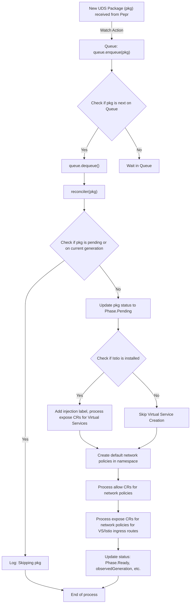

## UDS Operator

The UDS Operator manages the lifecycle of UDS Package CRs and their corresponding resources (e.g. NetworkPolicies, Istio VirtualServices, etc.). The operator uses [Pepr](https://pepr.dev) to bind the watch operations to the enqueue and reconciler. The operator is responsible for:

- enabling Istio sidecar injection in namespaces where the CR is deployed
- establishing default-deny ingress/egress network policies 
- creating a layered allow-list based approach on top of the default deny network policies including some basic defaults such as Istio requirements and DNS egress
- providing targeted remote endpoints network policies such as `KubeAPI` and `CloudMetadata` to make policies more DRY and provide dynamic bindings where a static definition is not possible
- creating Istio Virtual Services & related ingress gateway network policies

### Key Files and Folders

```bash
.
├── controllers          # Core business logic called by the reconciler
│   ├── istio            # Manages Istio VirtualServices and sidecar injection for UDS Packages/Namespace
│   └── network          # Manages default and generated NetworkPolicies for UDS Packages/Namespace
├── crd
│   ├── generated        # Type files generated by `uds run -f src/pepr/tasks.yaml gen-crds`
│   ├── sources          # CRD source files
│   ├── register.ts      # Registers the UDS Package CRD with the Kubernetes API
│   └── validator.ts     # Validates UDS Package CRs with Pepr
├── enqueue.ts           # Serializes UDS Package CRs for processing by the reconciler
├── index.ts             # Entrypoint for the UDS Operator
└── reconciler.ts        # Reconciles UDS Package CRs via the controllers
```


### Flow

The UDS Operator leverages a Pepr Watch. The following diagram shows the flow of the UDS Operator:


